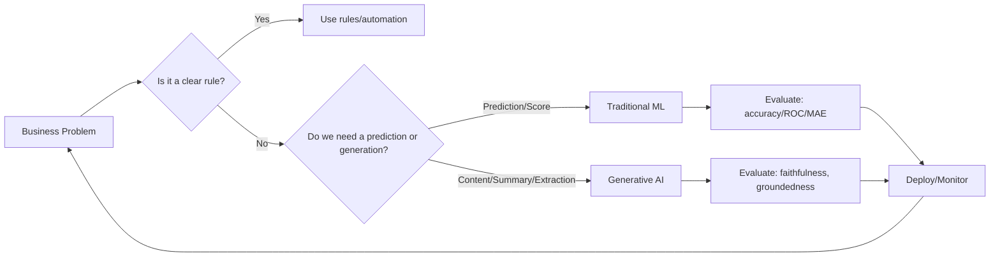

# AI Overview

## Why it matters
- AI only creates value when it **improves a decision, increases speed, or scales an outcome**—this keeps us out of "cool demo" territory.
- Clear distinctions (rules vs ML vs GenAI) help you **pick the simplest tool** that works and control risk/cost.
- Framing work as **problems, not models** aligns stakeholders and avoids solution-wandering.
- A shared overview is the foundation for **governance, measurement, and rollout** across teams.

## Core concepts
- **Expert systems / rules**: deterministic logic, auditable, great when policies are stable and edge cases are few.
- **Machine Learning (prediction)**: learns from data to predict labels, scores, or quantities (classification, regression, ranking).
- **Generative AI (production)**: creates new text/images/code; excels at summarizing, drafting, extracting structure, and reasoning over unstructured data.
- **Value levers**:  
  - **Decision quality** (fewer errors, better targeting)  
  - **Speed** (cycle time, time-to-insight)  
  - **Scale** (more cases served with same headcount)
- **Fit test** — When *not* to use AI: no data or ground truth, rules are simple and stable, stakes are high and explainability is mandatory, or cost/latency budgets can't be met.

## Diagram

## Playbook (step-by-step)

1. **Define the deployment goal** (business value) and the prediction/production goal (what the system must output).

2. **Map constraints**: latency, cost per request, privacy/compliance, explainability.

3. **Choose the simplest pattern** that satisfies the goal (rules → ML → GenAI) and decide buy vs build.

4. **Data discovery**: sources, quality, access, consent, retention.

5. **Success metrics**: leading (adoption, cycle time) + lagging (NPS/revenue/error rate).

6. **Design evaluation**: offline tests + online A/B or holdout; define failure modes.

7. **Pilot with a narrow scope**; add guardrails, logging, and incident/rollback plans.

8. **Operationalize**: monitoring, refresh cadence, model cards, change management.

## Anti-patterns

- Starting with a model ("let's use LLMs") instead of a decision.
- Building a bespoke platform before a single validated use case.
- "Data lake first" with no users or questions defined.
- No owner for outcomes; only a technical lead.

## Checklist (copy/paste)

- [ ] Deployment goal and prediction/production goal are written and approved.
- [ ] Constraints documented (latency, cost, privacy, explainability).
- [ ] Pattern chosen for fit and simplicity.
- [ ] Evaluation plan with offline + online metrics.
- [ ] Pilot scope, rollback, and logging defined.
- [ ] Post-deployment monitoring + refresh plan in place.

## Metrics / Proof of value

**Decision**: error rate ↓, precision/recall ↑, cost per decision ↓.

**Speed**: cycle time ↓, time-to-first-draft ↓, queue time ↓.

**Scale**: cases handled/FTE ↑, coverage ↑, SLA adherence ↑.

**Adoption**: weekly active users, task completion rate, satisfaction/NPS.

## Further reading

- **The AI Playbook** — Eric Siegel (2024): practical BizML framing from deployment goal → metrics.
- **All-In on AI** — Davenport & Mittal (2023): operating model and leadership patterns.
- **Weapons of Math Destruction** — Cathy O'Neil (2016): risk & harm patterns to watch.
- **The Coming Wave** — Mustafa Suleyman (2023): macro lens on capability & governance.
