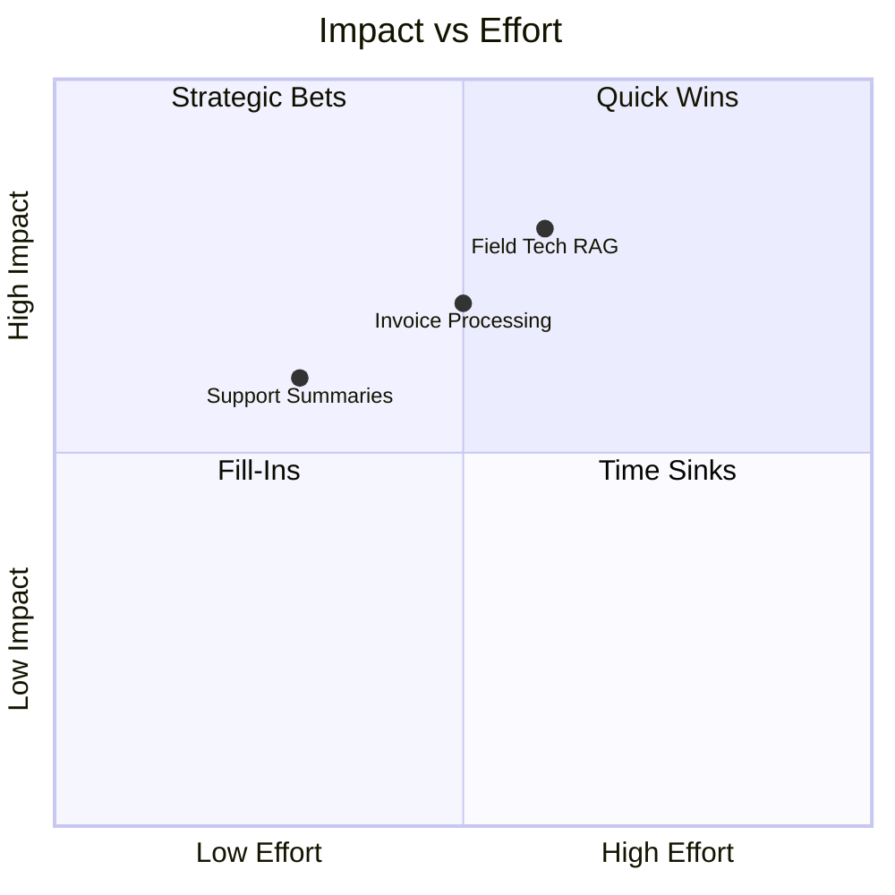

# Use Cases & Business Value

## Why it matters
- Picking the right **first 2–3 use cases** sets your credibility and momentum.
- A transparent scoring method lets stakeholders see **why** a use case wins or waits.
- Framing each idea as a **deployment goal → prediction/production goal → metrics** keeps teams aligned.

## Core concepts
- **Value levers**: cost ↓, revenue ↑, risk ↓, experience ↑, speed ↑.
- **Scoring model** (1–5 each; weights below):
  - **Impact (35%)** – magnitude of benefit if it works.
  - **Reach (15%)** – who/how many it touches.
  - **Data readiness (20%)** – access, quality, volume, permissions.
  - **Ease/Effort (20%)** – time-to-pilot, integration complexity (5 = easier).
  - **Risk/Compliance (10%)** – lower risk scores higher (5 = low).
- **Priority score** = `0.35*Impact + 0.15*Reach + 0.20*Data + 0.20*Ease + 0.10*Risk`.

## Diagram – impact vs effort

## Example scoring table
| Use case | Impact | Reach | Data | Ease | Risk | Score |
|----------|--------|-------|------|------|------|-------|
| Support ticket summarization + suggested replies | 3 | 4 | 4 | 4 | 4 | 3.65 |
| Invoice processing (AP automation) | 4 | 3 | 3 | 3 | 3 | 3.35 |
| Field technician RAG assistant | 5 | 2 | 2 | 3 | 4 | 3.45 |

Rank by score, then sanity‑check: Is the deployment owner clear? Is success measurable in 6–8 weeks?

## Playbook (step‑by‑step)

1. **Backlog jam**: collect 15–30 candidate use cases from leaders, ICs, and pain‑point reviews.

2. **Score together** (use the rubric above) to build alignment and surface data gaps.

3. **Write the one‑pager** for top 3:
   - Deployment goal (business value)
   - Prediction/production goal (exact output)
   - Users & workflow insertion point
   - Constraints (latency, cost, privacy)
   - Metrics (leading + lagging)

4. **Choose 1 quick win + 1 strategic bet** for the next quarter.

5. **Design the pilot**: scope, guardrails, eval plan, owner, rollback plan.

6. **After the pilot**: promote, park, or pivot. Document learnings into your playbook.

## Anti‑patterns

- Starting with "we need RAG/agents" instead of a business outcome.
- Scoring in a vacuum (one team) → stakeholders don't buy the result.
- "Data science only" projects with no process owner or workflow change.

## Checklist

- [ ] Scoring rubric + weights shared with stakeholders.
- [ ] Top 3 one‑pagers written and approved.
- [ ] Owners identified (business + technical).
- [ ] Pilot scope ≤ 8 weeks, with go/no‑go criteria.
- [ ] Comms plan for pilot users.

## Metrics / Proof of value

- **Cost/time**: handle time ↓, cycle time ↓, cost per case ↓.
- **Quality**: error rate ↓, precision/recall ↑ (where applicable).
- **Adoption**: weekly active users, retention, opt‑out rate.
- **Financials**: $ benefit vs run cost; payback period.

## Further reading

- Practical decision frameworks for AI project selection and ROI measurement.
- Public case studies on support summarization, document extraction, and RAG assistants.
