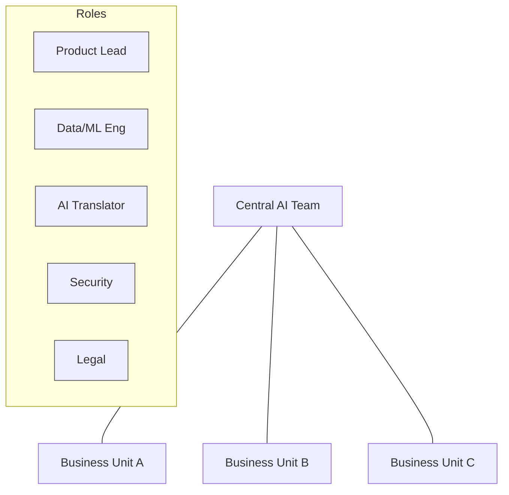

# Team Structures & Roles

## Why it matters
- **Clear roles** prevent confusion, duplication, and gaps in AI project delivery.
- **Team topology** affects speed, quality, and governance of AI initiatives.
- **RACI matrix** ensures accountability and smooth handoffs between phases.
- **Right structure** balances central expertise with business unit ownership.

## Core concepts
- **Product Lead**: owns business outcomes, prioritizes features, manages stakeholder relationships.
- **Subject Matter Expert (SME)**: provides domain knowledge, validates requirements, defines success criteria.
- **Data Engineer**: builds data pipelines, ensures data quality, manages infrastructure.
- **ML Engineer**: develops models, implements evaluation, handles deployment and monitoring.
- **AI Translator**: bridges business and technical teams, manages requirements, coordinates delivery.
- **PMO**: tracks progress, manages risks, ensures governance compliance.
- **Security**: reviews data handling, model security, access controls.
- **Legal**: ensures compliance, reviews data usage, manages vendor contracts.
- **Ethics**: identifies bias risks, ensures fairness, manages reputational risk.

## Diagram

## Playbook (step-by-step)

1. **Assess current state**: existing AI capabilities, team skills, governance maturity.

2. **Choose team topology**:
   - **Centralized**: Single AI team serves all business units
   - **Federated**: AI specialists embedded in each business unit
   - **Hybrid**: Central team + embedded specialists

3. **Define core roles** based on project scope and complexity.

4. **Create RACI matrix** for key project phases and deliverables.

5. **Establish governance** structure and approval processes.

6. **Plan capability building** for roles that need development.

7. **Set up collaboration** tools and communication protocols.

## Team topologies comparison

| Aspect | Centralized | Federated | Hybrid |
|--------|-------------|-----------|---------|
| **Speed** | Medium | High | High |
| **Quality** | High | Variable | High |
| **Cost** | Medium | High | High |
| **Governance** | Strong | Weak | Strong |
| **Business Alignment** | Medium | High | High |
| **Best for** | Early AI adoption, compliance-heavy | Fast experimentation, business ownership | Scale with governance |

## RACI matrix for AI pilot

| Activity | Exec Sponsor | Product Lead | Data/ML Eng | Business SME | Security | Legal |
|----------|--------------|--------------|-------------|--------------|----------|-------|
| **Scope approval** | A | R | C | C | C | C |
| **Requirements** | C | R | C | A | C | C |
| **Data access** | C | R | A | C | A | A |
| **Model development** | C | C | A | C | C | C |
| **Evaluation** | C | R | A | A | C | C |
| **Deployment** | A | R | A | C | A | A |
| **Monitoring** | C | R | A | C | C | C |

**R** = Responsible, **A** = Accountable, **C** = Consulted, **I** = Informed

## Role responsibilities deep dive

### Product Lead
- **Owns**: Business outcomes, stakeholder relationships, feature prioritization
- **Delivers**: Requirements, success metrics, user stories, acceptance criteria
- **Skills**: Product management, stakeholder management, business acumen
- **Time**: 50-100% depending on project scope

### AI Translator
- **Owns**: Requirements translation, team coordination, delivery management
- **Delivers**: Technical requirements, project plan, status updates, risk mitigation
- **Skills**: Technical background + business understanding, project management
- **Time**: 100% for complex projects, 25-50% for simple ones

### Data Engineer
- **Owns**: Data infrastructure, pipeline reliability, data quality
- **Delivers**: Clean datasets, data documentation, pipeline monitoring
- **Skills**: SQL, Python, data modeling, ETL tools, cloud platforms
- **Time**: 50-100% depending on data complexity

### ML Engineer
- **Owns**: Model development, evaluation, deployment, monitoring
- **Delivers**: Trained models, evaluation reports, deployment scripts, monitoring dashboards
- **Skills**: Python, ML frameworks, cloud deployment, MLOps tools
- **Time**: 100% for model development, 25-50% for maintenance

## Anti-patterns

- **Role confusion**: unclear who owns what, leading to gaps or duplication.
- **Missing translator**: business and technical teams can't communicate effectively.
- **Over-centralization**: bottlenecks slow down all AI initiatives.
- **Under-governance**: no oversight leads to quality and compliance issues.
- **Skill gaps**: roles defined without considering team capabilities.

## Checklist (copy/paste)

- [ ] Team topology chosen based on organization size and AI maturity.
- [ ] Core roles defined with clear responsibilities and skill requirements.
- [ ] RACI matrix created for key project phases and deliverables.
- [ ] Governance structure established with approval processes.
- [ ] Capability gaps identified and development plan created.
- [ ] Collaboration tools and communication protocols established.
- [ ] Security, legal, and ethics roles integrated into project planning.

## Metrics / Proof of value

**Leading indicators**: Role clarity scores, stakeholder satisfaction, project velocity.

**Lagging indicators**: Project success rate, time-to-value, stakeholder adoption.

**Team effectiveness**: Role coverage, skill development, collaboration quality.

**Governance health**: Compliance rate, risk mitigation, audit findings.

## Further reading

- **Team Topologies** — Skelton & Pais (2019): organizational design for modern software delivery.
- **The AI Playbook** — Eric Siegel (2024): team structures and role definitions for AI projects.
- **All-In on AI** — Davenport & Mittal (2023): leadership and organizational models for AI.
- **Building AI Applications** — O'Reilly (2023): practical team building and project management.
