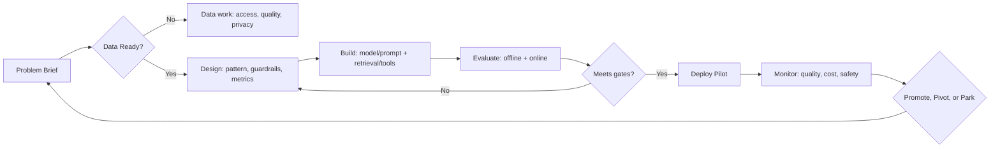

# AI Lifecycle & Governance

## Why it matters
- Clear stage gates enable **speed without surprises** across Legal, Security, Risk, and Ops.
- Governance should be **right‑sized**: strong enough to protect, light enough to ship.

## Core concepts
- **Lifecycle**: problem framing → data → modeling → evaluation → deployment → monitoring → refresh.
- **Risk tiers** (example):
  - **T1** – assistive, human‑in‑the‑loop, low external impact.
  - **T2** – customer‑facing assistance or internal decisions with $$ impact.
  - **T3** – high‑stakes decisions (credit, safety, rights) → strict approvals.
- **Artifacts**: Problem brief, Data card, Model/Prompt card, Eval plan/results, Post‑deploy report.

## Diagram – stage gates

## Data Governance Quickstart

### **Data Classification & Handling**
- [ ] **Classify inputs**: {Public | Internal | Confidential | Restricted/PII}
- [ ] **Map sources + owners + retention periods**
- [ ] **Consent/contract terms** for training vs inference use
- [ ] **Redaction plan** (pre‑prompt scrubbing of PII/secrets)
- [ ] **Data lineage notes** (how data flows through RAG/ETL)
- [ ] **Incident response contacts + 24h reporting path**

### **Privacy & Compliance**
- [ ] **Data residency** requirements identified
- [ ] **PII handling** procedures documented
- [ ] **Retention policies** aligned with business needs
- [ ] **Access controls** and audit logging enabled
- [ ] **Vendor terms** reviewed for data handling

### **Security Controls**
- [ ] **Encryption** at rest and in transit
- [ ] **Access controls** with least privilege
- [ ] **Monitoring** for unusual data access patterns
- [ ] **Incident response** plan tested
- [ ] **Backup and recovery** procedures documented

## Playbook (stage gates)

1. **Problem brief approved**: owner, deployment goal, output spec, constraints, risk tier.

2. **Data gate**: source inventory, consent/PII review, retention policy, lineage notes.

3. **Design gate**: chosen pattern (rules/ML/GenAI), eval plan, guardrails, privacy posture, cost/latency budget.

4. **Eval gate**: offline metrics + red‑team results; UAT with rubric; "ship criteria."

5. **Deploy gate**: monitoring hooks (quality, cost, safety), rollback, change log.

6. **Operate/refresh**: drift checks, incident response, periodic re‑eval, audit trail.

## Anti‑patterns

- Copy‑pasting web prompts into production with no artifact trail.
- "Set and forget" deployments—no monitoring or refresh cadence.
- Treating GenAI as exempt from software change control.

## Checklist

- [ ] Risk tier assigned; approvals mapped.
- [ ] Data card + model/prompt card complete.
- [ ] Eval plan with golden set, adversarial set, and thresholds.
- [ ] Monitoring: quality, cost, latency, safety; alerting on regressions.
- [ ] Post‑deploy review scheduled (30/60/90 days).

## Metrics / Proof of value

- **Gate lead time**, approval turnaround, defect leak rate, incidents/month, time‑to‑rollback.

## Further reading

- Model/Prompt card examples, red‑teaming checklists, human‑in‑the‑loop design patterns.
