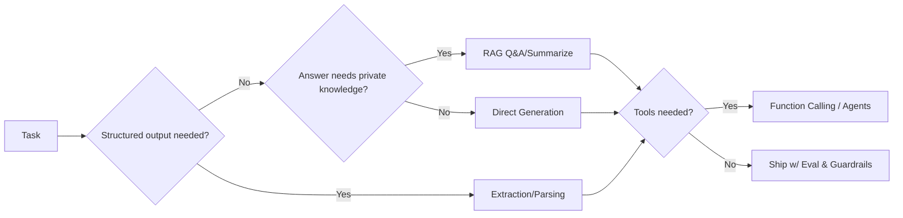

# GenAI Patterns & Prompting

## Why it matters
- Pattern-driven design turns "prompt tinkering" into **repeatable systems** with measurable quality.
- Good prompting + retrieval + evaluation unlocks **reliable outputs** and lower cost/latency.
- Shared patterns enable **governance**, faster onboarding, and vendor portability.

## Core concepts
- **Inputs & controls**: instructions, few-shot examples, tools/functions, system rules, temperature/top-p, stop sequences.  
- **Context window economics**: tokens = money + latency; retrieve only what's needed.  
- **Tool use**: the model calls functions (search, calculators, CRUD) to ground and act.  
- **Retrieval-augmented generation (RAG)**: fetch source facts → generate grounded answers.  
- **Agents**: multi-step planners using tools + memory; powerful, but require guardrails.  
- **Evaluation**: faithfulness/groundedness, task success, cost, latency, safety.

## Diagram — choosing a GenAI pattern


## Playbook (step-by-step)

1. **Define the output shape** (schema, rubric, or style) and guardrails.

2. **Pick a pattern**:
   - Summarize (briefs, meeting notes)
   - Q&A / RAG (grounded answers)
   - Extraction (fill JSON schema)
   - Classification/Routing (labels → flows)
   - Tool-using generation (calculations, lookups, CRUD)

3. **Design prompts with CRAFT**:
   - **Context**: what the model knows + constraints
   - **Role**: who it is (tone, perspective)
   - **Assets**: examples, schemas, APIs
   - **Format**: exact output spec (JSON/Markdown)
   - **Tests**: golden cases + adversarials

4. **Add retrieval (if needed)**: chunking strategy, embed+index, rerank, citations.

5. **Attach tools (if needed)**: JSON schemas for functions; idempotent side-effects.

6. **Evaluate**: faithfulness, exact-match/F1 for structured output, human rubric scores.

7. **Instrument & ship**: logging, cost/latency budgets, safety filters, rollback.

## Common patterns (with mini-templates)

### 1) Summarization (role brief or meeting minutes)

**Prompt skeleton**
```
You are a concise analyst.
Summarize the input into:
- Key decisions
- Risks/assumptions
- Action items (owner, due date)
Limit to 7 bullets. Use the source's terminology. Avoid speculation.
```

**Metrics**: compression ratio, coverage (did it capture the labeled items?), human rubric.

### 2) RAG Q&A (grounded answers with citations)

**Retrieval tips**: domain-specific chunking, Top-k=3–8, hybrid search (sparse+dense), rerank.

**Answer template**
```
Answer based only on the provided sources.
If unsure, say "Not in the provided documents."
Return:
- Direct answer (≤120 words)
- 2–4 bullet rationale
- Citations [doc-id:page]
```

**Metrics**: retrieval recall@k, groundedness score, exact-match/F1 for QA sets, latency.

### 3) Structured extraction (fill a schema)

**JSON schema example**
```json
{
  "company": "string",
  "decision_date": "YYYY-MM-DD",
  "risk_flags": ["enum: security|legal|bias|cost"],
  "owners": [{"name":"string","role":"string"}]
}
```

**Prompt**: "Extract fields per schema. If missing, return null. Do not invent."

**Metrics**: field-level precision/recall, schema validity rate.

### 4) Classification & routing

**Prompt**: "Assign exactly one label from {Billing, Tech Support, Sales}. Return JSON: {\"label\": \"<one>\"}."

**Metrics**: accuracy, balanced accuracy, confusion matrix; measure down-stream success.

### 5) Tool use / function calling

**Design**: keep functions small and verifiable (e.g., lookup_contract(id), sum(numbers)), rate-limit side-effects, require explicit user confirmation for risky actions.

**Metrics**: task completion rate, tool success rate, cost per task.

## Anti-patterns

- Stuffing entire wikis into context; retrieve narrowly and rerank.
- Shipping to production with no eval harness or golden set.
- Using RAG to mask bad data or unclear policy.
- Over-prompting instead of fixing retrieval or using a tool.
- Relying on a single giant model when a smaller + tools combo hits the target.

## Checklist (copy/paste)

- [ ] Output spec (schema or rubric) agreed by stakeholders.
- [ ] Pattern chosen; retrieval/tooling plan documented.
- [ ] Prompt includes role, rules, examples, and exact format.
- [ ] Golden set (10–50 examples) + adversarial cases.
- [ ] Evaluation: faithfulness, task metrics, cost/latency budget.
- [ ] Logging, safety filters, and rollback path enabled.

## Metrics / Proof of value

**RAG**: recall@k, groundedness, citation accuracy, latency.

**Summarization**: coverage, faithfulness, editor time saved.

**Extraction**: field-level F1, invalid-JSON rate.

**Tool use**: task completion rate, retries per task, cost per task.

**Overall**: adoption, time saved, SLA adherence, net benefit ($).

## Further reading

- **Eric Siegel** — The AI Playbook (BizML framing & deployment mindset).
- **Anthropic** — Prompting & evaluation guides (patterns and safety framing).
- **Open-source "RAG best practices" guides** (hybrid search, reranking, chunking).
- **Microsoft Guidance / other eval harness repos** (prompt & tool orchestration ideas).
