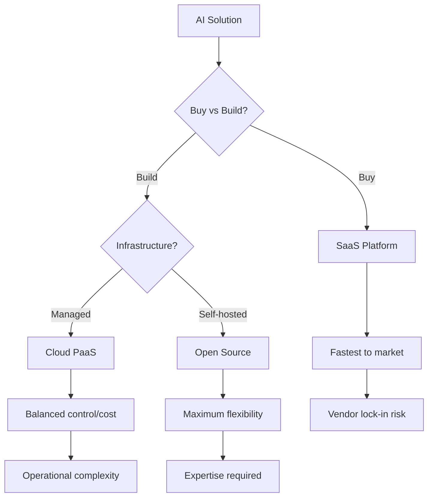
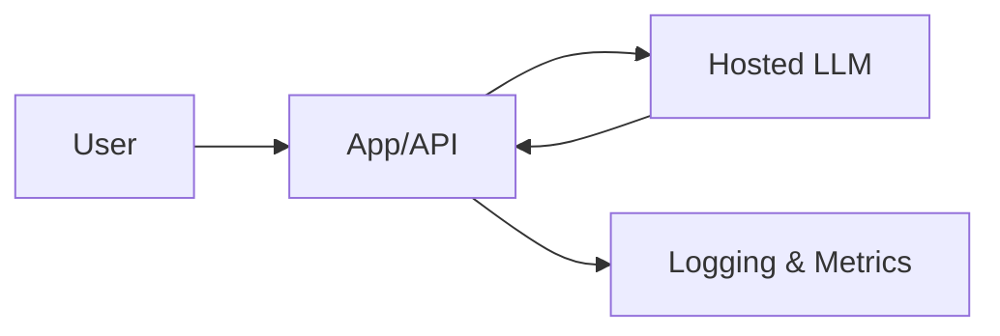
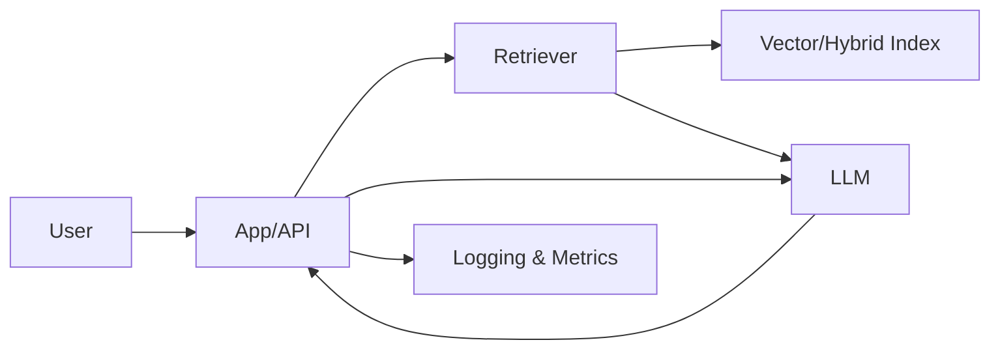
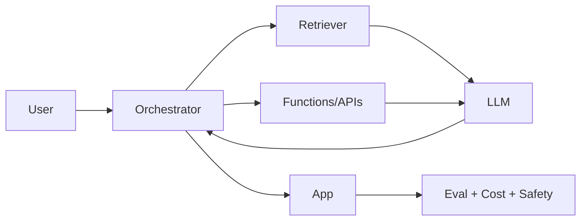

# Platforms & Tools Tradeoffs

## Why it matters
- **Build vs buy decisions** significantly impact time-to-market, cost, and technical debt.
- **Platform selection** affects scalability, vendor lock-in, and operational complexity.
- **Tool choices** determine development velocity, maintenance burden, and team productivity.
- **Trade-off analysis** prevents over-engineering and ensures fit-for-purpose solutions.

## Core concepts
- **SaaS platforms**: Ready-to-use AI services with minimal setup, limited customization, potential vendor lock-in.
- **Cloud PaaS**: Managed infrastructure with more control, higher complexity, better scalability.
- **Open source**: Maximum flexibility, highest complexity, requires expertise, no vendor lock-in.
- **Latency-cost-quality triangle**: Trade-offs between response time, operational cost, and output quality.
- **Privacy posture**: Data residency, encryption, access controls, compliance certifications.
- **GPU vs CPU**: Specialized hardware for training/inference vs general-purpose processing.

## Diagram

## Playbook (step-by-step)

1. **Assess requirements**: Performance needs, data privacy, compliance, budget, timeline.

2. **Evaluate build vs buy spectrum**:
   - **SaaS**: Use existing services (OpenAI, Anthropic, etc.)
   - **Cloud PaaS**: Build on managed infrastructure (AWS SageMaker, Azure ML)
   - **Open source**: Self-host and manage everything

3. **Analyze trade-offs**: Cost, time, control, scalability, maintenance.

4. **Consider ecosystem**: Integration capabilities, vendor relationships, team expertise.

5. **Plan migration**: Avoid lock-in, design for portability, maintain data ownership.

6. **Test and validate**: Proof of concept, performance benchmarking, cost analysis.

## Build vs buy decision framework

### When to buy (SaaS)
- **Time pressure**: Need to deploy quickly
- **Limited expertise**: Team lacks AI/ML skills
- **Standard use case**: Common patterns like text generation, classification
- **Small scale**: Limited data volume or user base
- **Budget constraints**: Can't afford custom development

### When to build (Cloud PaaS/OSS)
- **Unique requirements**: Custom algorithms or workflows
- **Data privacy**: Sensitive data can't leave premises
- **Scale requirements**: High volume, low latency needs
- **Integration complexity**: Deep integration with existing systems
- **Cost optimization**: High volume justifies custom development

### Hybrid approach
- **Start with SaaS**: Quick validation and learning
- **Migrate to custom**: As requirements and scale grow
- **Maintain flexibility**: Design for easy migration between platforms

## Platform comparison

| Platform Type | Time to Market | Cost | Control | Scalability | Maintenance |
|---------------|----------------|------|---------|-------------|-------------|
| **SaaS** | 1-2 weeks | Pay-per-use | Low | High | None |
| **Cloud PaaS** | 1-3 months | Medium | Medium | High | Low |
| **Open Source** | 3-6 months | Low | High | Variable | High |

## Reference architectures

### Direct Generation

### RAG Basic

### RAG + Tools/Agents

## Architecture trade-offs

| Pattern | Latency | Cost | Privacy | Complexity | Best For |
|---------|---------|------|---------|------------|----------|
| **Direct Gen** | Low | Low | Medium | Low | Simple Q&A, content generation |
| **RAG Basic** | Medium | Medium | High | Medium | Knowledge retrieval, document Q&A |
| **RAG + Tools** | High | High | High | High | Complex workflows, multi-step reasoning |

## Major ecosystems overview

### OpenAI
- **Strengths**: Best-in-class models, simple API, extensive documentation
- **Weaknesses**: Vendor lock-in, pricing volatility, limited customization
- **Best for**: Quick prototypes, standard use cases, when quality is paramount

### Anthropic
- **Strengths**: Safety-focused, Claude models, constitutional AI
- **Weaknesses**: Smaller model selection, higher latency, limited tools
- **Best for**: Safety-critical applications, enterprise compliance

### Google Cloud AI
- **Strengths**: Enterprise integration, comprehensive tooling, global infrastructure
- **Weaknesses**: Complex pricing, steep learning curve, Google dependency
- **Best for**: Enterprise customers, existing Google ecosystem

### Open models (Llama, Mistral)
- **Strengths**: No vendor lock-in, customizable, cost-effective at scale
- **Weaknesses**: Requires expertise, infrastructure costs, variable quality
- **Best for**: Cost-sensitive applications, custom requirements, data privacy

## Latency-cost-quality triangle

### High quality, low latency
- **Cost**: High (premium models, dedicated infrastructure)
- **Use cases**: Real-time applications, user-facing features
- **Examples**: Live chat, real-time recommendations

### High quality, low cost
- **Latency**: High (batch processing, queue-based systems)
- **Use cases**: Background processing, analytics, reporting
- **Examples**: Document analysis, batch predictions

### Low cost, low latency
- **Quality**: Lower (smaller models, simplified processing)
- **Use cases**: High-volume, non-critical applications
- **Examples**: Content moderation, basic classification

## Privacy and compliance considerations

### Data residency
- **On-premises**: Full control, highest compliance, highest cost
- **Regional clouds**: Geographic compliance, moderate control, moderate cost
- **Global clouds**: Lowest cost, limited compliance, vendor dependency

### Encryption and access
- **Data at rest**: Encrypted storage, key management, access controls
- **Data in transit**: TLS encryption, API security, authentication
- **Data in use**: Runtime protection, memory isolation, secure processing

### Compliance frameworks
- **GDPR**: Data protection, consent management, right to deletion
- **HIPAA**: Healthcare data protection, audit trails, access controls
- **SOC 2**: Security, availability, processing integrity, confidentiality

## Anti-patterns

- **Vendor lock-in**: Building critical systems on proprietary platforms without exit strategy.
- **Over-engineering**: Building custom solutions when SaaS would suffice.
- **Ignoring costs**: Focusing only on technical capabilities without cost analysis.
- **No migration plan**: Assuming current platform choice is permanent.
- **Team mismatch**: Choosing tools beyond team capabilities.

## Checklist (copy/paste)

- [ ] Requirements assessed: performance, privacy, compliance, budget, timeline.
- [ ] Build vs buy decision made with stakeholder input.
- [ ] Platform options evaluated against requirements and constraints.
- [ ] Trade-off analysis completed: cost, time, control, scalability, maintenance.
- [ ] Migration strategy planned to avoid vendor lock-in.
- [ ] Proof of concept completed with selected platform.
- [ ] Cost analysis updated with real usage data.
- [ ] Team training and capability building planned.

## Metrics / Proof of value

**Leading indicators**: Platform selection time, proof of concept completion, team training progress.

**Lagging indicators**: Time to market, development cost, operational efficiency.

**Platform effectiveness**: Performance metrics, cost per request, availability, scalability.

**Team productivity**: Development velocity, maintenance burden, incident frequency.

## Further reading

- **The AI Playbook** — Eric Siegel (2024): platform selection and build vs buy strategies.
- **Building Machine Learning Powered Applications** — Hulten (2020): practical platform implementation.
- **Cloud Native AI** — O'Reilly (2023): modern AI infrastructure and deployment patterns.
- **MLOps: Continuous Delivery for Machine Learning** — MLOps Community (2023): operational best practices.
