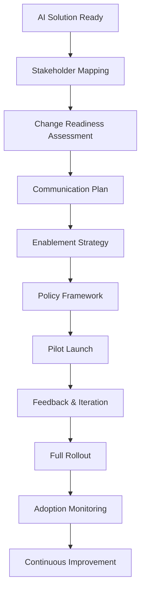

# Change Management & Rollout

## Why it matters
- **Stakeholder alignment** prevents resistance and ensures successful AI adoption.
- **Communication planning** builds trust and manages expectations throughout the journey.
- **Enablement strategy** ensures users can effectively use AI tools and realize value.
- **Policy framework** provides guardrails and addresses concerns about AI usage.

## Core concepts
- **Stakeholder mapping**: Identifying all parties affected by AI changes and their influence/interest levels.
- **Change readiness**: Assessing organizational capacity for AI adoption and identifying barriers.
- **Enablement path**: Training, support, and resources needed for successful AI usage.
- **Policy quickstart**: Acceptable use policies, data handling guidelines, and governance frameworks.
- **Adoption metrics**: Leading and lagging indicators to measure AI adoption and impact.
- **A/B experiments**: Controlled rollouts to validate AI solutions and measure incremental value.

## Diagram


## Playbook (step-by-step)

1. **Map stakeholders**: Identify all affected parties, their influence, and their concerns.

2. **Assess change readiness**: Evaluate organizational capacity, identify barriers, and plan mitigation.

3. **Develop communication plan**: Key messages, channels, timing, and feedback mechanisms.

4. **Design enablement strategy**: Training, support, documentation, and change champions.

5. **Create policy framework**: Acceptable use, data handling, governance, and compliance.

6. **Launch pilot**: Start small, gather feedback, iterate, and build confidence.

7. **Scale rollout**: Expand gradually, monitor adoption, and address issues.

8. **Monitor and improve**: Track metrics, gather feedback, and continuously enhance.

## Stakeholder mapping framework

### Influence vs Interest Matrix

| High Influence, High Interest | High Influence, Low Interest |
|-------------------------------|------------------------------|
| **Engage closely** | **Keep satisfied** |
| - Executive sponsors | - Legal/compliance |
| - Business leaders | - Finance |
| - Key users | - IT security |

| Low Influence, High Interest | Low Influence, Low Interest |
|------------------------------|------------------------------|
| **Keep informed** | **Monitor** |
| - End users | - General staff |
| - Subject matter experts | - Support teams |
| - Change champions | - External partners |

### Communication strategy by stakeholder type

- **Champions**: Involve in design, give ownership, recognize contributions.
- **Neutrals**: Provide information, address concerns, show benefits.
- **Resistors**: Listen to concerns, address fears, find common ground.
- **Sponsors**: Keep updated, provide support, remove barriers.

## Change readiness assessment

### Organizational factors
- **Leadership support**: Executive sponsorship and commitment.
- **Change capacity**: Previous change experience and current workload.
- **Culture**: Risk tolerance, innovation mindset, collaboration patterns.
- **Resources**: Budget, time, skills, and infrastructure.

### Individual factors
- **Awareness**: Understanding of AI and its benefits.
- **Desire**: Motivation to adopt and use AI tools.
- **Knowledge**: Skills and training needed for AI usage.
- **Ability**: Capacity to implement and sustain changes.
- **Reinforcement**: Support and recognition for AI adoption.

### Readiness score calculation
```
Readiness Score = (Leadership + Culture + Resources + Skills) / 4
- 4.0-3.5: Ready to proceed
- 3.4-2.5: Address gaps before proceeding
- 2.4-1.0: Significant barriers, reconsider timeline
```

## Communication plan template

### Key messages
1. **Why change**: Business drivers, competitive pressure, efficiency gains.
2. **What's changing**: Specific AI capabilities, user experience, workflows.
3. **How it helps**: Benefits for users, teams, and organization.
4. **What to expect**: Timeline, training, support, and success metrics.

### Communication channels
- **Executive**: All-hands meetings, leadership updates, strategic communications.
- **Management**: Team meetings, manager briefings, Q&A sessions.
- **Users**: Training sessions, user guides, support channels, feedback forums.
- **Stakeholders**: Project updates, milestone celebrations, progress reports.

### Timing and frequency
- **Pre-launch**: Weekly updates, training announcements, expectation setting.
- **Launch**: Daily updates, immediate support, quick wins celebration.
- **Post-launch**: Weekly progress reports, monthly success stories, quarterly reviews.

## Enablement strategy

### Training approach
- **Just-in-time**: Contextual help, tooltips, guided tours.
- **Role-based**: Customized training for different user types and responsibilities.
- **Progressive**: Start simple, add complexity as users become comfortable.
- **Hands-on**: Practical exercises, real scenarios, immediate application.

### Support structure
- **First line**: Self-service resources, FAQs, knowledge base.
- **Second line**: AI champions, power users, community support.
- **Third line**: Technical support, escalation procedures, expert assistance.

### Change champions
- **Selection criteria**: Early adopters, influencers, positive attitude.
- **Responsibilities**: Peer support, feedback collection, success story sharing.
- **Recognition**: Public acknowledgment, career development, special projects.

## Policy framework quickstart

### Acceptable use policy
- **Purpose**: Clear guidelines on when and how to use AI tools.
- **Boundaries**: Prohibited uses, data limitations, output validation.
- **Responsibilities**: User accountability, reporting requirements, incident response.
- **Consequences**: Violation handling, disciplinary actions, appeal process.

### Data handling guidelines
- **Input data**: What can be shared, privacy requirements, consent management.
- **Output data**: Validation requirements, human review thresholds, quality standards.
- **Retention**: Data storage, deletion policies, audit requirements.
- **Sharing**: Internal distribution, external sharing, confidentiality requirements.

### Governance framework
- **Approval process**: Who can approve AI usage, escalation procedures.
- **Risk assessment**: Impact analysis, bias evaluation, compliance review.
- **Monitoring**: Performance tracking, usage analytics, compliance auditing.
- **Review cycle**: Regular assessment, policy updates, continuous improvement.

## Adoption metrics and A/B experiments

### Leading indicators
- **Awareness**: Knowledge of AI capabilities, understanding of benefits.
- **Engagement**: Tool usage, feature adoption, feedback participation.
- **Confidence**: User satisfaction, perceived value, recommendation likelihood.
- **Readiness**: Training completion, support ticket volume, change resistance.

### Lagging indicators
- **Adoption**: Active users, usage frequency, feature utilization.
- **Impact**: Efficiency gains, quality improvements, cost savings.
- **Satisfaction**: User ratings, retention rates, word-of-mouth.
- **ROI**: Business value, cost reduction, productivity improvements.

### A/B experiment design
- **Control group**: Current process or baseline system.
- **Treatment group**: AI-enhanced process or new system.
- **Randomization**: Random assignment to ensure fair comparison.
- **Metrics**: Primary (business impact) and secondary (user experience) measures.
- **Duration**: Sufficient time to capture meaningful differences.
- **Analysis**: Statistical significance, practical significance, business relevance.

## Anti-patterns

- **Top-down only**: Imposing change without user input or buy-in.
- **One-size-fits-all**: Same approach for all users regardless of role or readiness.
- **Big bang rollout**: Launching everything at once without piloting or iteration.
- **Training only**: Providing training without ongoing support or reinforcement.
- **No feedback loop**: Launching without mechanisms to gather and act on user input.

## Checklist (copy/paste)

- [ ] Stakeholder mapping completed with influence and interest levels.
- [ ] Change readiness assessment conducted and gaps identified.
- [ ] Communication plan developed with key messages and channels.
- [ ] Enablement strategy designed with training and support approach.
- [ ] Policy framework created with acceptable use and governance guidelines.
- [ ] Pilot program planned with success criteria and feedback mechanisms.
- [ ] Adoption metrics defined with leading and lagging indicators.
- [ ] A/B experiment designed for controlled rollout and validation.

## Metrics / Proof of value

**Leading indicators**: Stakeholder engagement, training completion, support ticket volume.

**Lagging indicators**: User adoption, feature utilization, business impact metrics.

**Change effectiveness**: Adoption rate, user satisfaction, resistance reduction.

**Business value**: Efficiency gains, quality improvements, cost savings, ROI.

## Further reading

- **Leading Change** — John Kotter (2012): comprehensive change management framework.
- **Switch** — Chip Heath & Dan Heath (2010): practical change psychology and implementation.
- **The AI Playbook** — Eric Siegel (2024): AI-specific change management and rollout strategies.
- **Change Management for AI** — MIT Sloan (2023): organizational change in the AI era.
