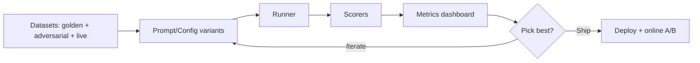

# Evaluation Harness (Offline + Online)

## Why it matters
- Without a harness, you **can't compare** prompts, models, retrieval configs, or costs.
- A small golden set + adversarials gives you **fast, repeatable decisions**.

## Core concepts
- **Datasets**:
  - **Golden set** (10–100 cases): curated, labeled answers or rubrics.
  - **Adversarial set**: edge cases, ambiguous inputs, tricky phrasing.
  - **Live set**: sampled production traffic (for shadow eval).
- **Scorers**:
  - Exact match / F1 for structured tasks.
  - Rubric scoring for summarization (LLM‑as‑judge with bias controls).
  - Groundedness/faithfulness for RAG (cite‑check).
- **Arms to compare**: prompt versions, retrieval params (k, chunking, rerank), model families, temperature, tool chains.

## Diagram – harness workflow


## Playbook

1. **Define the task and output format** (JSON schema or rubric).

2. **Build datasets**: 50–100 golden examples is enough to start; add 10–20 adversarials.

3. **Pick scorers**:
   - Structured: exact match/F1.
   - Free‑text: rubric with 3–5 criteria (coverage, faithfulness, tone, brevity).
   - RAG: groundedness score + citation accuracy.

4. **Run experiments across arms**; log quality, cost, latency for each.

5. **Select a champion**; lock a baseline; store configs (prompt, params, retrieval).

6. **Online test**: A/B or shadow mode; watch user success and cost.

7. **Guardrail tests**: jailbreaks, prompt injection, personally identifiable info leakage.

## Example rubric (summarization)
| Criterion | 0 | 1 | 2 |
|-----------|---|---|---|
| Coverage | Misses key points | Captures most | Captures all essentials |
| Faithfulness | Hallucinations | Minor errors | Fully grounded |
| Brevity | Overlong | Slightly long | Concise (≤120 words) |
| Tone | Off | Mostly on | On‑brand |

## Example YAML (experiment config)
```yaml
task: "support_summary"
model: "gpt-4o-mini"
temperature: 0.3
retrieval:
  top_k: 6
  rerank: true
  filters: ["date>2023-01-01"]
prompt_variant: "v3_system_role_rules"
scorers:
  - exact_match
  - rubric_faithfulness
  - cost_latency
```

## Anti‑patterns

- Using the same LLM to both answer and judge without bias mitigations.
- No frozen baseline—you can't detect regressions.
- Shipping with zero adversarial cases.

## Checklist

- [ ] Golden + adversarial sets stored and versioned.
- [ ] Champion/baseline recorded with prompts + params.
- [ ] Cost/latency ceilings set and enforced.
- [ ] Online A/B plan + stop criteria.
- [ ] Guardrail tests in CI.

## Metrics / Proof of value

- **Quality delta vs baseline**, cost per task, p‑values for online tests, regression rate.

## Further reading

- Open evaluation harness repos and lessons from retrieval quality research.
